## Load your libraries

```r
library(tidyverse)
```

```
## ── Attaching packages ─────────────────────────────────────── tidyverse 1.3.0 ──
```

```
## ✓ ggplot2 3.3.3     ✓ purrr   0.3.4
## ✓ tibble  3.0.6     ✓ dplyr   1.0.4
## ✓ tidyr   1.1.2     ✓ stringr 1.4.0
## ✓ readr   1.4.0     ✓ forcats 0.5.1
```

```
## ── Conflicts ────────────────────────────────────────── tidyverse_conflicts() ──
## x dplyr::filter() masks stats::filter()
## x dplyr::lag()    masks stats::lag()
```

```r
library(RColorBrewer)
library(paletteer)
library(janitor)
```

```
## 
## Attaching package: 'janitor'
```

```
## The following objects are masked from 'package:stats':
## 
##     chisq.test, fisher.test
```

```r
library(here)
```

```
## here() starts at /Users/adriannang98/Desktop/BIS15W2021_ang
```

```r
library(skimr)
library(ggthemes)
```

## Removing scientific notation

```r
options(scipen=999) #cancels scientific notation for the session, not permanently
```
For the purposes of graphing, you're gonna want to use this to turn off scientific notation before your graphs get *really* funky.

# Graphing
## The Grammar of Graphics and You
The "gg" in `ggplot` stands for grammar of graphics. Plots are built in layers, and the grammar of graphics defines the layers. 

The syntax used by ggplot takes some practice to get used to, especially for customizing plots, but the basic elements are the same. It is helpful to think of plots as being built up in layers.  

In short, **plot = data + geom_ + aesthetics**. We start by calling the ggplot function, identifying the data, and specifying the axes (x, y). We then add the `geom` type to describe how we want our data represented. Each `geom_` works with specific types of data and R is capable of building plots of single variables, multiple variables, and even maps. Lastly, we add aesthetics.

There are three main data types you will be dealing with as you build your plots.
+ `discrete` quantitative data that only contains *integers*
+ `continuous` quantitative data that can take *any numerical value*
+ `categorical` qualitative data that can take on a *limited number of values*

Because we love the `homerange` dataset so much ~~(and not because I am making this really late so I couldn't figure out fun things with the video game data frames)~~, let's use it here too.

```r
homerange <- read_csv(here("class_resources", "data", "Tamburelloetal_HomeRangeDatabase.csv"))
```

```
## 
## ── Column specification ────────────────────────────────────────────────────────
## cols(
##   .default = col_character(),
##   mean.mass.g = col_double(),
##   log10.mass = col_double(),
##   mean.hra.m2 = col_double(),
##   log10.hra = col_double(),
##   preymass = col_double(),
##   log10.preymass = col_double(),
##   PPMR = col_double()
## )
## ℹ Use `spec()` for the full column specifications.
```

## Scatterplots
Scatter plots are good at revealing relationships that are not readily visible in the raw data.

### `geom_point()`

```r
homerange %>% 
  ggplot(mapping = aes(x = log10.mass, y = log10.hra)) + # note, you don't need `mapping =`... just there for clarity
  geom_point()
```

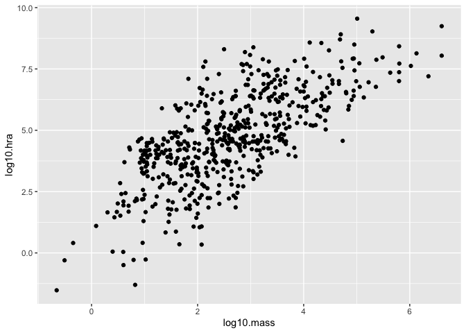<!-- -->

### `geom_jitter()`
`geom_jitter()` is similar to `geom_point()` but it helps with over plotting by adding some random noise to the data and separating some of the individual points.

```r
homerange %>% 
  ggplot(aes(x = log10.mass, y = log10.hra)) +
  geom_jitter() +
  geom_smooth(method=lm, se=T) #adds the regression line, `se=TRUE` will add standard error (95% CI interval, se=F just gives the line)
```

```
## `geom_smooth()` using formula 'y ~ x'
```

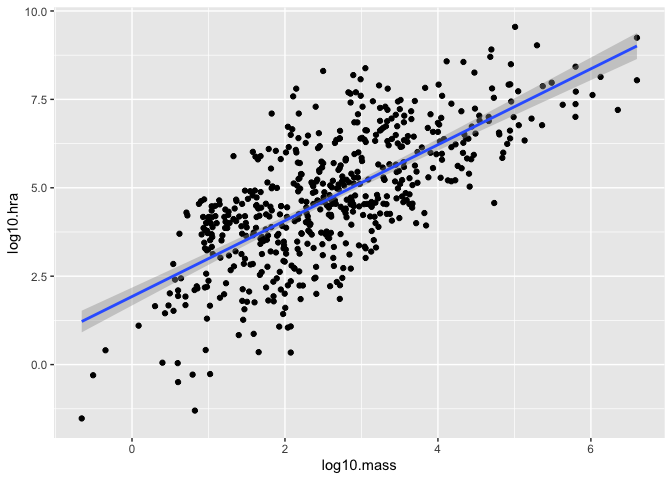<!-- -->

## Barplots

### `geom_bar()`
The simplest type of bar plot counts the number of observations in a categorical variable.

```r
homerange %>% 
  ggplot(aes(x=trophic.guild)) + 
  geom_bar()
```

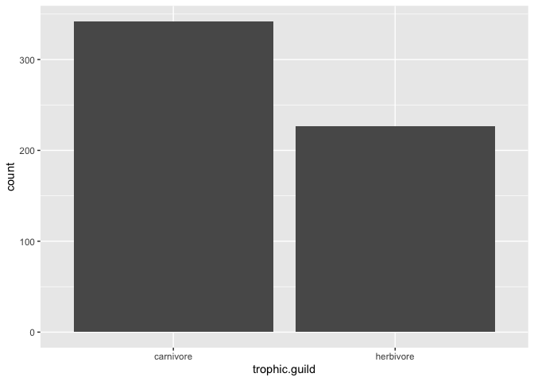<!-- -->
Normally, geom_bar() will get upset if you have more than one variable stated. However, you can still use geom_bar() in another fashion...
`geom_bar()` with `stat="identity"`
`stat="identity"` allows us to map a variable to the y-axis so that we aren't restricted to counts.

```r
homerange %>% 
  filter(family=="salmonidae") %>% 
  ggplot(aes(x=common.name, y=log10.mass))+
  geom_bar(stat="identity")
```

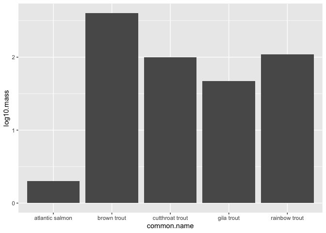<!-- -->


### `geom_col()`
Unlike `geom_bar()`, `geom_col()` allows us to specify an x-axis *and* a y-axis. ==> Use for specifying x and y axis only.

```r
homerange %>% 
  filter(family == "salmonidae") %>% 
  ggplot(aes(x = common.name, y = log10.mass))+
  geom_col()
```

<!-- -->

You can use all these things to make some really fancy graphs.

```r
homerange %>% 
  filter(class == "mammalia") %>% 
  top_n(-10, log10.mass) %>%   # bottom ten of the specified variable
  ggplot(aes(x = reorder(common.name, log10.mass), y = log10.mass)) + # the `reorder()` function allows you to reorder the variable based on another... we said we wanted to "reorder" the common.name axis by the log10 mass!
  geom_col() +
  coord_flip() # flips the x and y axis orientations
```

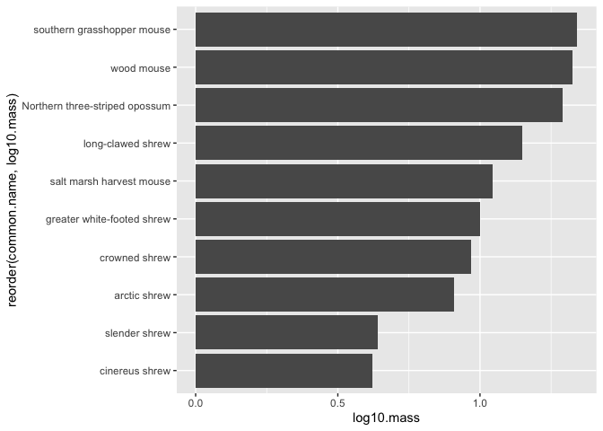<!-- -->

## Boxplots: `geom_boxplot()
Boxplots help us visualize a range of values. So, on the x-axis we typically have something *categorical* and the y-axis is the *range* (or somekind of continuous measurement).

```r
homerange %>% 
  filter(trophic.guild == "carnivore", class == "mammalia") %>%
  ggplot(aes(x = reorder(family, log10.mass), y = log10.mass)) +
  geom_boxplot() +
  coord_flip()
```

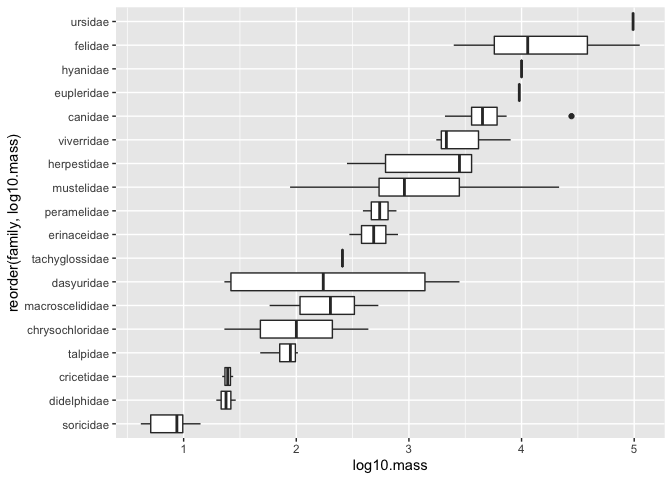<!-- -->

## Line plots: `geom_line()`
Line plots are great when you need to show changes over time.

```r
deserts <- read_csv(here("lab11", "data", "surveys_complete.csv"))
```

```
## 
## ── Column specification ────────────────────────────────────────────────────────
## cols(
##   record_id = col_double(),
##   month = col_double(),
##   day = col_double(),
##   year = col_double(),
##   plot_id = col_double(),
##   species_id = col_character(),
##   sex = col_character(),
##   hindfoot_length = col_double(),
##   weight = col_double(),
##   genus = col_character(),
##   species = col_character(),
##   taxa = col_character(),
##   plot_type = col_character()
## )
```

```r
deserts$year <- as.factor(deserts$year)
```


```r
deserts %>% 
  filter(species_id=="DM" | species_id=="DS") %>% 
  group_by(year, species_id) %>% 
  summarise(n=n()) %>% 
  ggplot(aes(x=year, y=n, group=species_id, color=species_id))+
  geom_line()+
  geom_point(shape=1)+ #shape refers to the points on the graph
  theme(axis.text.x = element_text(angle = 60, hjust = 1))+
  labs(title = "Number of samples for species DM",
       x = "Year",
       fill = "n")
```

```
## `summarise()` has grouped output by 'year'. You can override using the `.groups` argument.
```

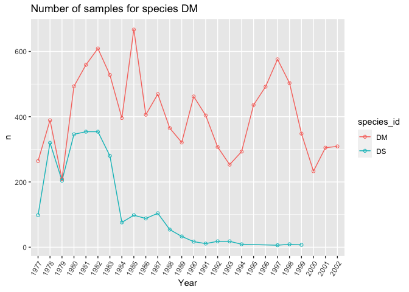<!-- -->
Why did we assign years as a factor? Because R normally treats it as a numeric, so if you left it as a numeric, you wouldn't get that nice clean distinction of years we see right now.

## Histograms: `geom_histogram()`
Histograms are frequently used by biologists; they show the distribution of continuous variables. As students, you almost certainly have seen histograms of grade distributions. Without getting into the statistics, a histogram `bins` the data and you specify the number of bins that encompass a range of observations. For something like grades, this is easy because the number of bins corresponds to the grades A-F. By default, R uses a formula to calculate the number of bins but some adjustment is often required. Don't change the bins unless your data is weird.


```r
homerange %>% 
  ggplot(aes(x = log10.mass)) +
  geom_histogram(alpha = 0.6, color = "black", fill = "deepskyblue4", bins=40)+
  labs(title = "Distribution of Body Mass")
```

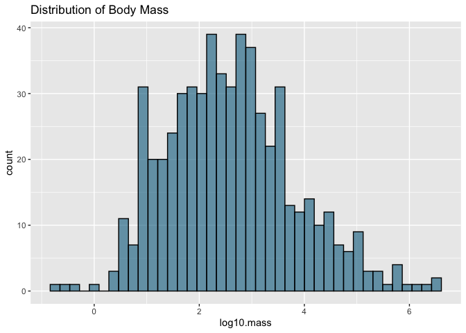<!-- -->

## Density plots: `geom_density()`
Density plots are similar to histograms but they use a smoothing function to make the distribution more even and clean looking. They do not use bins.

```r
homerange %>% 
  ggplot(aes(x = log10.mass)) +
  geom_density(fill="steelblue", alpha  =0.6, color = "black")+
  labs(title = "Distribution of Body Mass")
```

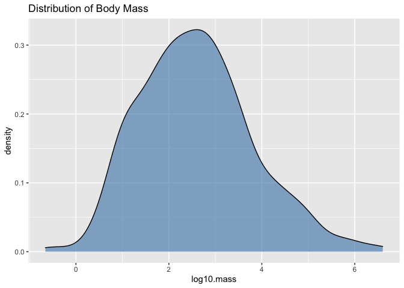<!-- -->
*Note, the `alpha =` changes the transparency of the coloring.

### `geom_histogram()` + `geom_density()` = cool

```r
homerange %>% 
  ggplot(aes(x=log10.mass)) +
  geom_histogram(aes(y = ..density..), fill = "steelblue", alpha = 0.8, color = "black")+
  geom_density(color = "red")+
  labs(title = "Distribution of Body Mass")
```

```
## `stat_bin()` using `bins = 30`. Pick better value with `binwidth`.
```

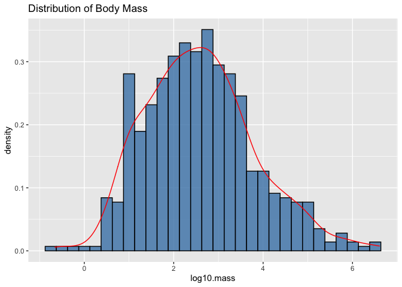<!-- -->


# Aesthetics
## Aesthetics: Cleaning your grpahs
Sometimes, your scales are going to get out of hand... here are some ways to account for that!

`scale_y_log10()` scales your y-axis to a log10 scale.

```r
life_history <- readr::read_csv(here("class_resources", "data", "mammal_lifehistories_v2.csv")) %>% 
  na_if("-999") %>% 
  clean_names()
```

```
## 
## ── Column specification ────────────────────────────────────────────────────────
## cols(
##   order = col_character(),
##   family = col_character(),
##   Genus = col_character(),
##   species = col_character(),
##   mass = col_double(),
##   gestation = col_double(),
##   newborn = col_double(),
##   weaning = col_double(),
##   `wean mass` = col_double(),
##   AFR = col_double(),
##   `max. life` = col_double(),
##   `litter size` = col_double(),
##   `litters/year` = col_double()
## )
```

```r
life_history %>% 
  group_by(order) %>% 
  summarise(mean_mass = mean(mass, na.rm = T)) %>% 
  ggplot(aes(x = order, y = mean_mass)) +
  geom_col() +
  coord_flip() +
  scale_y_log10() # this scales the y-axis based on a log-10 unit
```

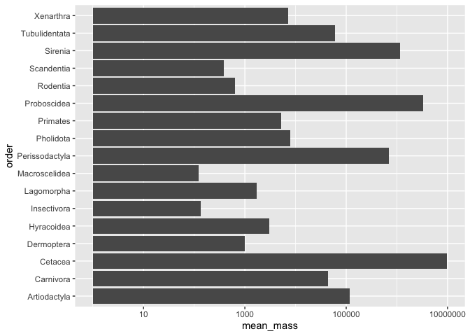<!-- -->

## Aesthetics: Labels
Now that we have practiced scatter plots, bar plots, and box plots we need to learn how to adjust their appearance to suit our needs. Let's start with labeling x and y axes.
The plots we have made so far look clean, but they're pretty incomplete incomplete. There isn't a title, and there aren't any units of measurements. A reader unfamiliar with the data might have a difficult time interpreting the labels. To add custom labels, we use the `labs` command.

```r
homerange %>% 
  filter(family == "salmonidae") %>% 
  ggplot(aes(x = common.name, y = log10.mass))+
  geom_col() +
  labs(x = "Common Name",
       y = "Mass",
       title = "Log10 Mass of Salmonidae")
```

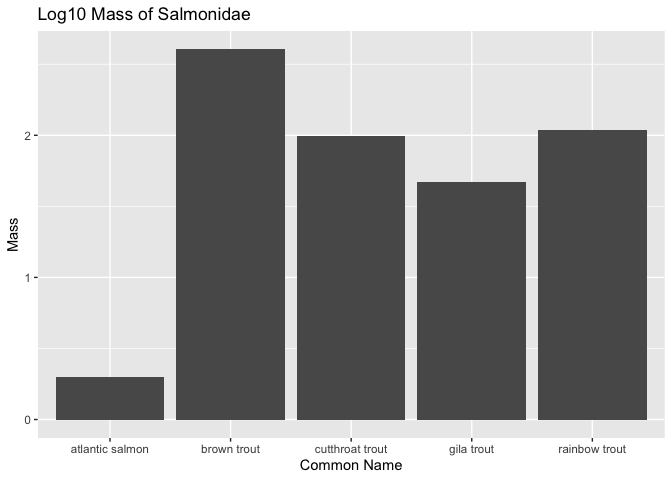<!-- -->

You can improve it further by adjusting the font and text size with `theme()`.

```r
homerange %>% 
  filter(family == "salmonidae") %>% 
  ggplot(aes(x = common.name, y = log10.mass))+
  geom_col() +
  labs(x = "Common Name",
       y = "Mass",
       title = "Log10 Mass of Salmonidae") +
  theme(plot.title = element_text(size = 12, face = "bold"),
        axis.text = element_text(size = 10),
        axis.title = element_text(size = 10))
```

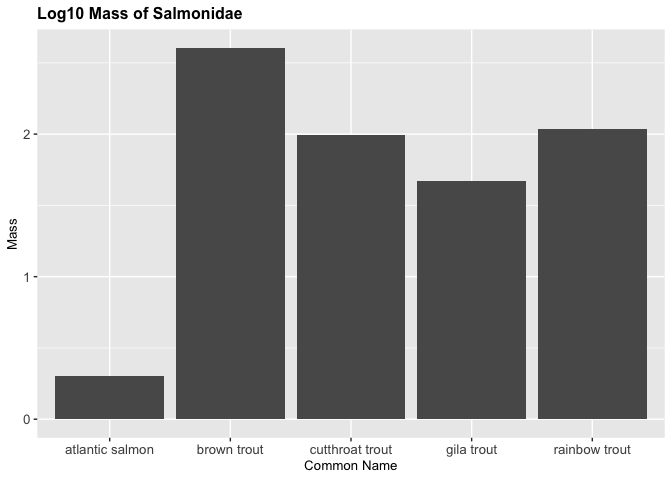<!-- -->

The `rel()` option changes the relative size of the title to keep things consistent. Adding `hjust` allows control of title position.

```r
homerange %>% 
  filter(family == "salmonidae") %>% 
  ggplot(aes(x = common.name, y = log10.mass))+
  geom_col() +
  labs(x = "Common Name",
       y = "Mass",
       title = "Log10 Mass of Salmonidae") +
  theme(plot.title = element_text(size = rel(1.5), hjust = 0))
```

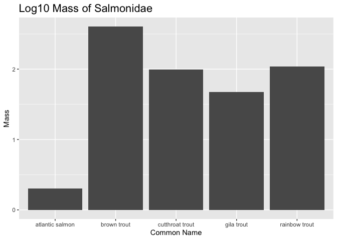<!-- -->

## Other aesthetics
There are lots of options for aesthetics. An aesthetic can be assigned to either numeric or categorical data. `fill` is a common grouping option; notice that an appropriate key is displayed when you use one of these options.


```r
homerange %>% 
  filter(family == "salmonidae" | family == "cervidae") %>% 
  ggplot(aes(x = common.name, y = log10.mass, fill = thermoregulation))+
  geom_col() +
  labs(x = "Common Name",
       y = "Mass",
       title = "Log10 Mass of Salmonidae and Cervidae") +
  theme(plot.title = element_text(size = rel(1.5), hjust = 0)) +
  coord_flip()
```

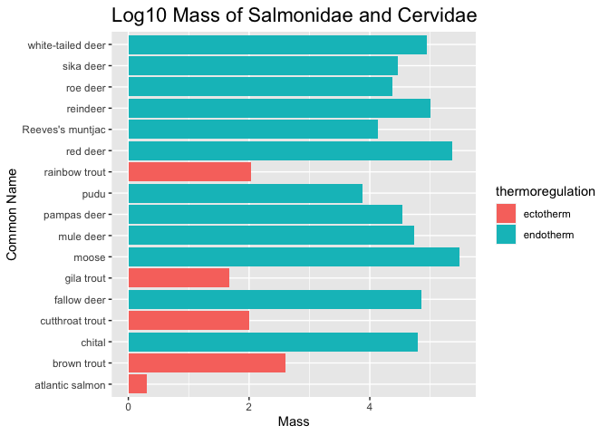<!-- -->
Wow, fish and deer. Cool.

`size =` adjusts the scale of points relative to a continuous variable or even a value of your choosing.

```r
life_history %>% 
  ggplot(aes(x = gestation, y = log10(mass), size = mass)) + #we don't have to use the y_scale_log10() separately, we can just use it here... the `size` function means your point is sized to the mass
  geom_point(na.rm=T)
```

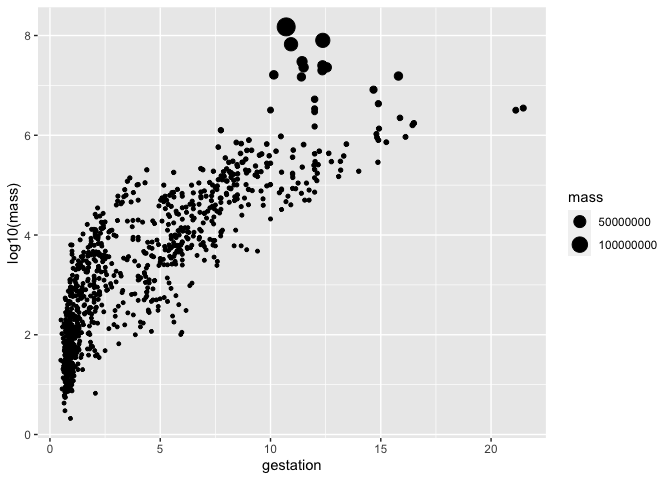<!-- -->

```r
homerange %>% 
  ggplot(aes(x= log10.mass, y= log10.hra)) +
  geom_point(size = .85)
```

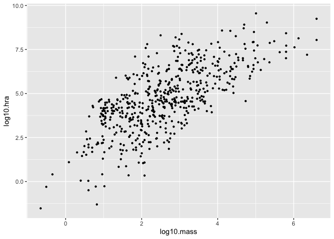<!-- -->

`shape = ` changes the shape of your points!

```r
homerange %>% 
  ggplot(aes(x= log10.mass, y= log10.hra)) +
  geom_point(aes(shape=thermoregulation), size=1.75)
```

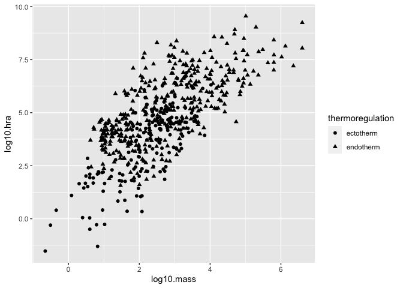<!-- -->


You can even use these things in conjunction with each other! The sky is the limit, my friend.

```r
homerange %>% 
  ggplot(aes(x= log10.mass, y= log10.hra)) +
  geom_point(aes(shape=thermoregulation, color=thermoregulation), size=1.75)
```

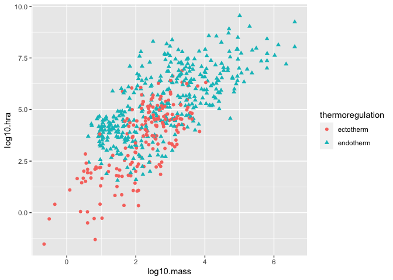<!-- -->

### A distinction for assigning color
`Fill =` and `color =` do some... very different things.

```r
homerange %>% 
  filter(family == "salmonidae" | family == "cervidae") %>% 
  ggplot(aes(x = common.name, y = log10.mass, fill = thermoregulation))+
  geom_col() +
  labs(x = "Common Name",
       y = "Mass",
       title = "Log10 Mass of Salmonidae and Cervidae") +
  theme(plot.title = element_text(size = rel(1.5), hjust = 0)) +
  coord_flip()
```

<!-- -->


```r
homerange %>% 
  filter(family == "salmonidae" | family == "cervidae") %>% 
  ggplot(aes(x = common.name, y = log10.mass, color = thermoregulation))+
  geom_col() +
  labs(x = "Common Name",
       y = "Mass",
       title = "Log10 Mass of Salmonidae and Cervidae") +
  theme(plot.title = element_text(size = rel(1.5), hjust = 0)) +
  coord_flip()
```

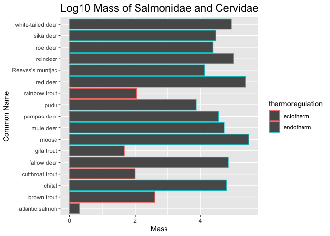<!-- -->
Be mindful of which one you choose!

Here are some other useful bits and pieces of code from previous lab examples.

`angle =` and `hjust =` will turn your labels on their sides!
`position = "dodge"` is designed to prevent your bars from overlapping.

```r
homerange %>% 
  ggplot(aes(x = taxon, fill = trophic.guild)) +
  geom_bar(position = "dodge") +
  theme(axis.text.x = element_text(angle = 60, hjust = 1)) + # this theme command prevents the text in the x-axs from overlapping!
  labs(title = "Observations by Taxon in Homerange Data",
       x = "Taxonomic Group",
       fill= "Trophic Guild")
```

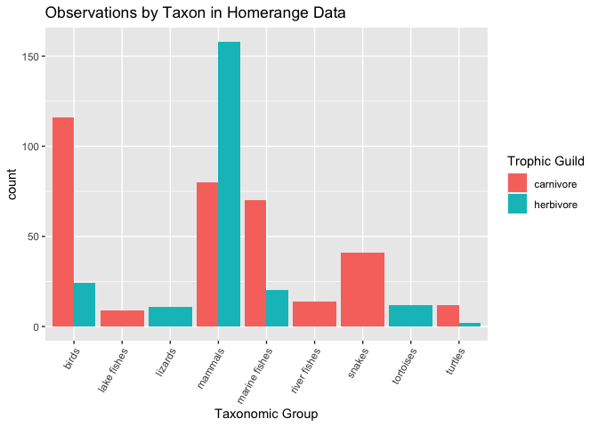<!-- -->

## Aestheics: grouping
In addition to `fill`, `group` is an aesthetic that accomplishes the same function but does not add color.

```r
homerange %>% 
  ggplot(aes(x = class, y = log10.mass, group = taxon)) +
  geom_boxplot()
```

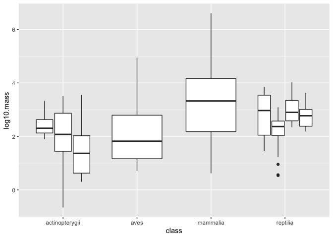<!-- -->

## Aesthetics: create Categories with `mutate()` and `case_when()`
`case_when()` is a very handy function from `dplyr` which allows us to calculate a new variable from other variables. We use `case_when()` within `mutate()` to do this.`case_when()` allows us to specify multiple conditions. Let's reclassify the body mass variable into a new factor variable with small, medium, and large animals.


```r
homerange <- homerange %>% 
             mutate(mass_category = case_when(log10.mass <= 1.75 ~ "small",
                                              log10.mass > 1.75 & log10.mass <= 2.75 ~ "medium",
                                              log10.mass > 2.75 ~ "large"))
glimpse(homerange)
```

```
## Rows: 569
## Columns: 25
## $ taxon                      <chr> "lake fishes", "river fishes", "river fish…
## $ common.name                <chr> "american eel", "blacktail redhorse", "cen…
## $ class                      <chr> "actinopterygii", "actinopterygii", "actin…
## $ order                      <chr> "anguilliformes", "cypriniformes", "cyprin…
## $ family                     <chr> "anguillidae", "catostomidae", "cyprinidae…
## $ genus                      <chr> "anguilla", "moxostoma", "campostoma", "cl…
## $ species                    <chr> "rostrata", "poecilura", "anomalum", "fund…
## $ primarymethod              <chr> "telemetry", "mark-recapture", "mark-recap…
## $ N                          <chr> "16", NA, "20", "26", "17", "5", "2", "2",…
## $ mean.mass.g                <dbl> 887.00, 562.00, 34.00, 4.00, 4.00, 3525.00…
## $ log10.mass                 <dbl> 2.9479236, 2.7497363, 1.5314789, 0.6020600…
## $ alternative.mass.reference <chr> NA, NA, NA, NA, NA, NA, NA, NA, NA, NA, NA…
## $ mean.hra.m2                <dbl> 282750.00, 282.10, 116.11, 125.50, 87.10, …
## $ log10.hra                  <dbl> 5.4514026, 2.4504031, 2.0648696, 2.0986437…
## $ hra.reference              <chr> "Minns, C. K. 1995. Allometry of home rang…
## $ realm                      <chr> "aquatic", "aquatic", "aquatic", "aquatic"…
## $ thermoregulation           <chr> "ectotherm", "ectotherm", "ectotherm", "ec…
## $ locomotion                 <chr> "swimming", "swimming", "swimming", "swimm…
## $ trophic.guild              <chr> "carnivore", "carnivore", "carnivore", "ca…
## $ dimension                  <chr> "3D", "2D", "2D", "2D", "2D", "2D", "2D", …
## $ preymass                   <dbl> NA, NA, NA, NA, NA, NA, 1.39, NA, NA, NA, …
## $ log10.preymass             <dbl> NA, NA, NA, NA, NA, NA, 0.1430148, NA, NA,…
## $ PPMR                       <dbl> NA, NA, NA, NA, NA, NA, 530, NA, NA, NA, N…
## $ prey.size.reference        <chr> NA, NA, NA, NA, NA, NA, "Brose U, et al. 2…
## $ mass_category              <chr> "large", "medium", "small", "small", "smal…
```


```r
homerange %>% 
  ggplot(aes(x = mass_category, fill = trophic.guild)) +
  geom_bar(position = "dodge") +
  labs(title = "Observations by Taxon and Mass Category in Homerange Data",
       x = "Mass Category",
       fill = "Trophic Guild")
```

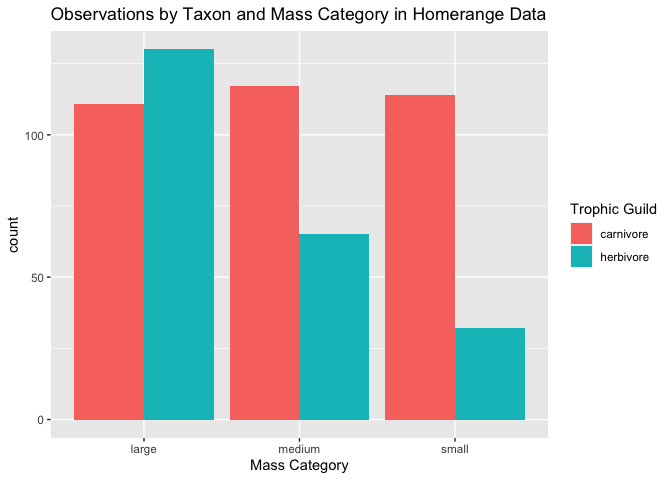<!-- -->
*Note, this section also went over quartiles as a way to identify these distinctions. See Lab 11.1 for details.*

# Colors and Readability

## `ggplot` themes
There are many option to change the theme of your plots. Have a look [here](https://www.datanovia.com/en/blog/ggplot-themes-gallery/) for some excellent examples. I am going to build a basic plot here and then use it throughout to illustrate the themes.

```r
homerange %>% 
  ggplot(aes(x=taxon, fill=trophic.guild)) +
  geom_bar(na.rm=T, position="dodge") +
  theme_classic()
```

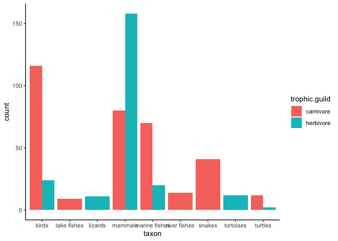<!-- -->

## Legends
There are lots of options to manipulate legends. Have a look [here](http://www.sthda.com/english/wiki/ggplot2-legend-easy-steps-to-change-the-position-and-the-appearance-of-a-graph-legend-in-r-software).

```r
homerange %>% 
  ggplot(aes(x=taxon, fill=trophic.guild))+
  geom_bar(na.rm=T, position="dodge") +
  theme_linedraw() +
  theme(legend.position = "top", #by default, legends are on the right
        axis.text.x = element_text(angle = 60, hjust=1))+
  labs(title = "Observations by Taxon in Homerange Data",
       x = NULL,
       y= "n",
       fill= "Trophic Guild")
```

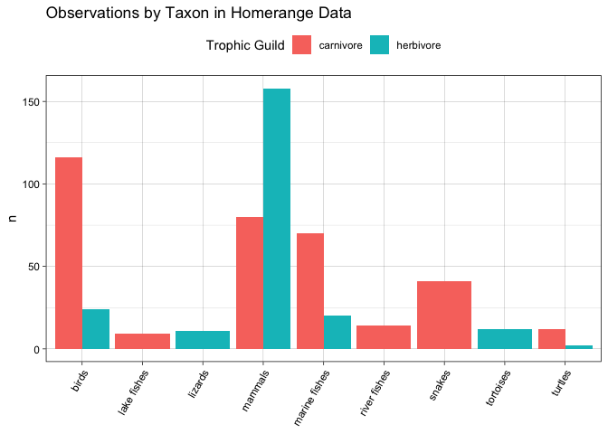<!-- -->

## RColorBrewer
The default colors used by ggplot are often uninspiring. They don't make plots pop out in presentations or publications, and you may want to use a customized palette to make things visually consistent.

To make things easy, use these two guidelines:

+`scale_colour_brewer()` is for *points*  (e.g. geom_point())
+`scale_fill_brewer()` is for *fills*  (e.g. geom_bar() or geom_col())


```r
homerange %>% 
  ggplot(aes(x=taxon, fill=trophic.guild))+
  geom_bar(na.rm=T, position="dodge") +
  scale_fill_brewer(palette = "Purples")+
  theme(legend.position = "bottom",
        axis.text.x = element_text(angle = 60, hjust=1))+
  labs(title = "Observations by Taxon in Homerange Data",
       x = NULL,
       y= "n",
       fill= "Trophic Guild")
```

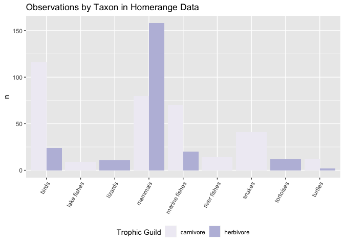<!-- -->

## Manually setting colors
You can also use `paleteer` to build a custom palette for consistency. To access the `paleteer` collection, I add it to a new object.


```r
colors <- paletteer::palettes_d_names
```

Now we can display the palettes. Assign the palette to `my_palette` and then build this base R bar plot. There are a lot of options; `paleteer` is a collection of popular palettes.

```r
my_palette <- paletteer::paletteer_d("ghibli::MononokeLight")
barplot(rep(1,5), axes=FALSE, col=my_palette)
```

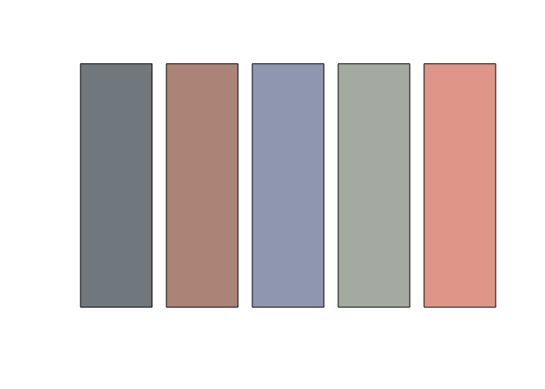<!-- -->
I am gutted there isn't a Howl's Moving Castle palette. But that's okay, Princess Mononoke is an equally good watch.

Anyways, you should apply your custom palette with `scale_fill_manual()`.

```r
homerange %>% 
  ggplot(aes(x=taxon, fill=trophic.guild))+
  geom_bar(na.rm=T, position="dodge") +
  scale_fill_manual(values=my_palette)+
  theme(legend.position = "bottom",
        axis.text.x = element_text(angle = 60, hjust=1))+
  labs(title = "Observations by Taxon in Homerange Data",
       x = NULL,
       y= "n",
       fill= "Trophic Guild")
```

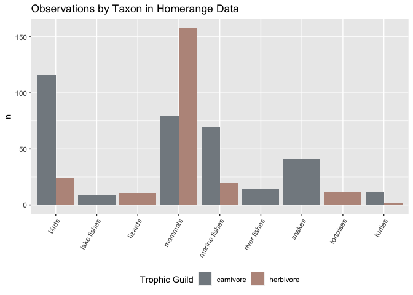<!-- -->

## Adjusting x and y limits
To adjust limits, we can use the `xlim` and `ylim` commands. When you do this, any data outside the specified ranges are not plotted.

```r
homerange %>% 
  ggplot(aes(x = log10.mass, y = log10.hra, color = locomotion)) +
  scale_color_brewer(palette = "Set3") +
  geom_point() +
  xlim(0, 4) + #zoom in between 0 and 4
  ylim(1, 6) # zoom in between 1 and 6 
```

```
## Warning: Removed 175 rows containing missing values (geom_point).
```

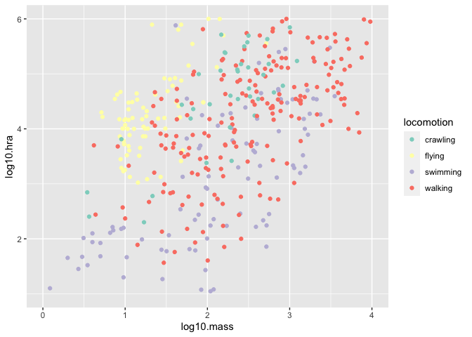<!-- -->


## Adding text

```r
homerange %>% 
  ggplot(aes(x = log10.mass, y = log10.hra, color = locomotion)) +
  geom_point() +
  annotate("text", label = "r^2 == 0", parse = T, x = 6, y = 0) # this is for adding text
```

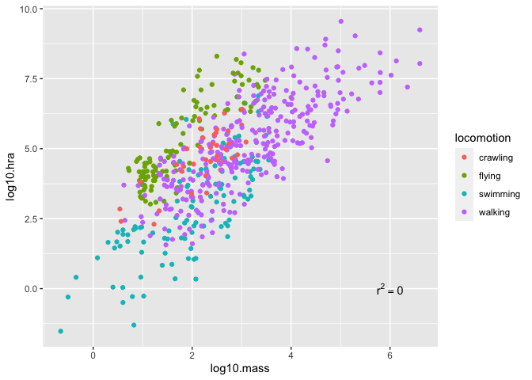<!-- -->

### Faceting
## Faceting: `facet_wrap()`
Learn to love it! It allows us to make multi-panel plots for easy comparison. 
We read the `~` in the `facet_wrap()` layer as `by`. The bin number doesn't work for every taxon, but it is enough to get the idea.


```r
homerange %>% 
  ggplot(aes(x = log10.mass)) +
  geom_density() +
  facet_wrap(~taxon)
```

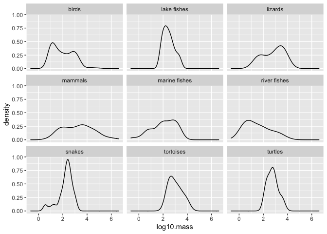<!-- -->

## Faceting: `facet_grid()`
As you can imagine, there are lots of options for faceting. Another useful facet type is `facet_grid`. 

```r
homerange %>% 
  ggplot(aes(x = log10.mass)) +
  geom_density() +
  facet_grid(thermoregulation~class)
```

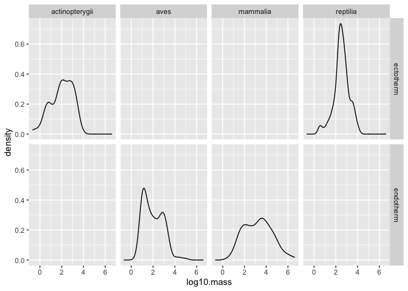<!-- -->
Remember, it won't plot for groupings that don't exist. This graph is saying this is the distribution of log10 mass for reptiles that are ectotherms.
