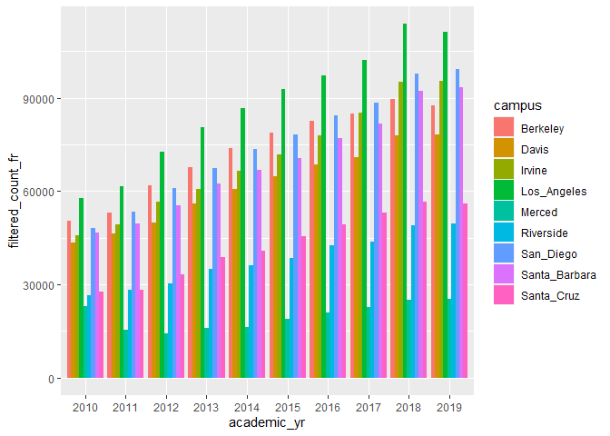

## Instructions
Answer the following questions and complete the exercises in RMarkdown. Please embed all of your code and push your final work to your repository. Your final lab report should be organized, clean, and run free from errors. Remember, you must remove the `#` for the included code chunks to run. Be sure to add your name to the author header above. For any included plots, make sure they are clearly labeled. You are free to use any plot type that you feel best communicates the results of your analysis.  

Make sure to use the formatting conventions of RMarkdown to make your report neat and clean!  

## Libraries

```r
if (!require("tidyverse")) install.packages('tidyverse')
```

```
## Loading required package: tidyverse
```

```
## -- Attaching packages --------------------------------------- tidyverse 1.3.0 --
```

```
## √ ggplot2 3.3.3     √ purrr   0.3.4
## √ tibble  3.1.0     √ dplyr   1.0.4
## √ tidyr   1.1.3     √ stringr 1.4.0
## √ readr   1.4.0     √ forcats 0.5.1
```

```
## -- Conflicts ------------------------------------------ tidyverse_conflicts() --
## x dplyr::filter() masks stats::filter()
## x dplyr::lag()    masks stats::lag()
```

```r
if (!require("RColorBrewer")) install.packages('RColorBrewer')
```

```
## Loading required package: RColorBrewer
```


```r
library(tidyverse)
library(shiny)
library(shinydashboard)
library(naniar)
library(janitor)
library(stringr)
library(RColorBrewer)
```

## Data
The data for this assignment come from the [University of California Information Center](https://www.universityofcalifornia.edu/infocenter). Admissions data were collected for the years 2010-2019 for each UC campus. Admissions are broken down into three categories: applications, admits, and enrollees. The number of individuals in each category are presented by demographic.  

```r
UC_admit <- readr::read_csv("data/UC_admit.csv")
```

```
## 
## -- Column specification --------------------------------------------------------
## cols(
##   Campus = col_character(),
##   Academic_Yr = col_double(),
##   Category = col_character(),
##   Ethnicity = col_character(),
##   `Perc FR` = col_character(),
##   FilteredCountFR = col_double()
## )
```

**1. Use the function(s) of your choice to get an idea of the overall structure of the data frame, including its dimensions, column names, variable classes, etc. As part of this, determine if there are NA's and how they are treated.**  


```r
UC_admit
```

```
## # A tibble: 2,160 x 6
##    Campus Academic_Yr Category   Ethnicity        `Perc FR` FilteredCountFR
##    <chr>        <dbl> <chr>      <chr>            <chr>               <dbl>
##  1 Davis         2019 Applicants International    21.16%              16522
##  2 Davis         2019 Applicants Unknown          2.51%                1959
##  3 Davis         2019 Applicants White            18.39%              14360
##  4 Davis         2019 Applicants Asian            30.76%              24024
##  5 Davis         2019 Applicants Chicano/Latino   22.44%              17526
##  6 Davis         2019 Applicants American Indian  0.35%                 277
##  7 Davis         2019 Applicants African American 4.39%                3425
##  8 Davis         2019 Applicants All              100.00%             78093
##  9 Davis         2018 Applicants International    19.87%              15507
## 10 Davis         2018 Applicants Unknown          2.83%                2208
## # ... with 2,150 more rows
```


```r
summary(UC_admit)
```

```
##     Campus           Academic_Yr     Category          Ethnicity        
##  Length:2160        Min.   :2010   Length:2160        Length:2160       
##  Class :character   1st Qu.:2012   Class :character   Class :character  
##  Mode  :character   Median :2014   Mode  :character   Mode  :character  
##                     Mean   :2014                                        
##                     3rd Qu.:2017                                        
##                     Max.   :2019                                        
##                                                                         
##    Perc FR          FilteredCountFR   
##  Length:2160        Min.   :     1.0  
##  Class :character   1st Qu.:   447.5  
##  Mode  :character   Median :  1837.0  
##                     Mean   :  7142.6  
##                     3rd Qu.:  6899.5  
##                     Max.   :113755.0  
##                     NA's   :1
```


```r
miss_var_summary(UC_admit)
```

```
## # A tibble: 6 x 3
##   variable        n_miss pct_miss
##   <chr>            <int>    <dbl>
## 1 Perc FR              1   0.0463
## 2 FilteredCountFR      1   0.0463
## 3 Campus               0   0     
## 4 Academic_Yr          0   0     
## 5 Category             0   0     
## 6 Ethnicity            0   0
```


```r
UC_admit <- clean_names(UC_admit)
UC_admit
```

```
## # A tibble: 2,160 x 6
##    campus academic_yr category   ethnicity        perc_fr filtered_count_fr
##    <chr>        <dbl> <chr>      <chr>            <chr>               <dbl>
##  1 Davis         2019 Applicants International    21.16%              16522
##  2 Davis         2019 Applicants Unknown          2.51%                1959
##  3 Davis         2019 Applicants White            18.39%              14360
##  4 Davis         2019 Applicants Asian            30.76%              24024
##  5 Davis         2019 Applicants Chicano/Latino   22.44%              17526
##  6 Davis         2019 Applicants American Indian  0.35%                 277
##  7 Davis         2019 Applicants African American 4.39%                3425
##  8 Davis         2019 Applicants All              100.00%             78093
##  9 Davis         2018 Applicants International    19.87%              15507
## 10 Davis         2018 Applicants Unknown          2.83%                2208
## # ... with 2,150 more rows
```


```r
UC_admit %>% 
  filter(filtered_count_fr <= 5)
```

```
## # A tibble: 5 x 6
##   campus academic_yr category  ethnicity       perc_fr filtered_count_fr
##   <chr>        <dbl> <chr>     <chr>           <chr>               <dbl>
## 1 Merced        2019 Enrollees American Indian 0.24%                   5
## 2 Merced        2016 Enrollees American Indian 0.20%                   4
## 3 Merced        2014 Enrollees International   0.06%                   1
## 4 Merced        2013 Enrollees International   0.12%                   2
## 5 Merced        2011 Enrollees International   0.07%                   1
```
Wow, really low freshman enrollment at Merced.


```r
uc_admit_perc <- UC_admit %>% 
  mutate(perc_fc_dbl = str_replace(perc_fr, "%", "")) %>% 
  select(-perc_fr)
uc_admit_perc$perc_fc_dbl <- as.numeric(uc_admit_perc$perc_fc_dbl)
uc_admit_perc$academic_yr <- as.factor(uc_admit_perc$academic_yr)
uc_admit_perc
```

```
## # A tibble: 2,160 x 6
##    campus academic_yr category   ethnicity        filtered_count_fr perc_fc_dbl
##    <chr>  <fct>       <chr>      <chr>                        <dbl>       <dbl>
##  1 Davis  2019        Applicants International                16522       21.2 
##  2 Davis  2019        Applicants Unknown                       1959        2.51
##  3 Davis  2019        Applicants White                        14360       18.4 
##  4 Davis  2019        Applicants Asian                        24024       30.8 
##  5 Davis  2019        Applicants Chicano/Latino               17526       22.4 
##  6 Davis  2019        Applicants American Indian                277        0.35
##  7 Davis  2019        Applicants African American              3425        4.39
##  8 Davis  2019        Applicants All                          78093      100   
##  9 Davis  2018        Applicants International                15507       19.9 
## 10 Davis  2018        Applicants Unknown                       2208        2.83
## # ... with 2,150 more rows
```


```r
tabyl(uc_admit_perc$ethnicity)
```

```
##  uc_admit_perc$ethnicity   n percent
##         African American 270   0.125
##                      All 270   0.125
##          American Indian 270   0.125
##                    Asian 270   0.125
##           Chicano/Latino 270   0.125
##            International 270   0.125
##                  Unknown 270   0.125
##                    White 270   0.125
```


```r
tabyl(uc_admit_perc$campus)
```

```
##  uc_admit_perc$campus   n   percent
##              Berkeley 240 0.1111111
##                 Davis 240 0.1111111
##                Irvine 240 0.1111111
##           Los_Angeles 240 0.1111111
##                Merced 240 0.1111111
##             Riverside 240 0.1111111
##             San_Diego 240 0.1111111
##         Santa_Barbara 240 0.1111111
##            Santa_Cruz 240 0.1111111
```

**2. The president of UC has asked you to build a shiny app that shows admissions by ethnicity across all UC campuses. Your app should allow users to explore year, campus, and admit category as interactive variables. Use shiny dashboard and try to incorporate the aesthetics you have learned in ggplot to make the app neat and clean.**

What kind of graphs do I want? Bar plot for counts: variables on the x-axis, counts on the y-axis. Color by ethnicity?

```r
uc_admit_perc %>%
  group_by(campus) %>% 
  filter(ethnicity == "All") %>% 
  ggplot(aes(x = academic_yr, y = filtered_count_fr, fill = campus)) +
  geom_col(position = "dodge")
```

<!-- -->

Attempt #3

```r
ui <- dashboardPage(skin = "black",
  dashboardHeader(title = "University of California Admissions from 2010 - 2019",
                  titleWidth = 600),
  dashboardSidebar(disable = T),
  dashboardBody(
  fluidRow(
  box(title = "Plot Options", width = 3,
  selectInput("x", "Select Admission Criteria", choices = c("academic_yr", "campus", "category"), 
              selected = "academic_yr"),
      hr(),
      helpText("Reference: University of California Information Center, Admissions (2010-2019)")
  ), # close the first box
  box(title = "Admissions by Ethnicity", width = 6,
  plotOutput("plot", width = "600px", height = "500px")
  ) # close the second box
  ) # close the row
  ) # close the dashboard body
) # close the ui

server <- function(input, output, session) { 
  
  output$plot <- renderPlot({
  uc_admit_perc %>%
  ggplot(aes_string(x = "ethnicity", y = "filtered_count_fr", fill = input$x)) +
  scale_fill_brewer(palette = "Paired") +
  geom_col(position = "dodge") + 
  theme(axis.text.x = element_text(angle = 60, hjust = 1)) +
  theme_minimal() +
  labs(y = "Number of Individuals",
       x = "Ethnicity")
  })
  
  # stop the app when we close it
  session$onSessionEnded(stopApp)
  }

shinyApp(ui, server)
```

```
## PhantomJS not found. You can install it with webshot::install_phantomjs(). If it is installed, please make sure the phantomjs executable can be found via the PATH variable.
```

`<div style="width: 100% ; height: 400px ; text-align: center; box-sizing: border-box; -moz-box-sizing: border-box; -webkit-box-sizing: border-box;" class="muted well">Shiny applications not supported in static R Markdown documents</div>`{=html}


**3. Make alternate version of your app above by tracking enrollment at a campus over all of the represented years while allowing users to interact with campus, category, and ethnicity.**

```r
ui <- dashboardPage(skin = "black",
  dashboardHeader(title = "University of California Admissions from 2010 - 2019",
                  titleWidth = 600),
  dashboardSidebar(disable = T),
  dashboardBody(
  fluidRow(
  box(title = "Plot Options", width = 3,
  selectInput("x", "Select Admission Criteria", choices = c("ethnicity", "campus", "category"), 
              selected = "academic_yr"),
      hr(),
      helpText("Reference: University of California Information Center, Admissions (2010-2019)")
  ), # close the first box
  box(title = "Admissions by Year", width = 6,
  plotOutput("plot", width = "600px", height = "500px")
  ) # close the second box
  ) # close the row
  ) # close the dashboard body
) # close the ui

server <- function(input, output, session) { 
  
  output$plot <- renderPlot({
  uc_admit_perc %>%
  #filter(campus == input$campus, ethnicity == input$ethnicity, category == input$category) %>% 
  ggplot(aes_string(x = "academic_yr", y = "filtered_count_fr", fill = input$x)) +
  scale_fill_brewer(palette = "Paired") +
  geom_col(position = "dodge") + 
  theme(axis.text.x = element_text(angle = 60, hjust = 1)) +
  theme_minimal() +
  labs(y = "Number of Individuals",
       x = "Academic Year")
  })
  
  # stop the app when we close it
  session$onSessionEnded(stopApp)
  }

shinyApp(ui, server)
```

`<div style="width: 100% ; height: 400px ; text-align: center; box-sizing: border-box; -moz-box-sizing: border-box; -webkit-box-sizing: border-box;" class="muted well">Shiny applications not supported in static R Markdown documents</div>`{=html}


## Push your final code to GitHub!
Please be sure that you check the `keep md` file in the knit preferences. 
