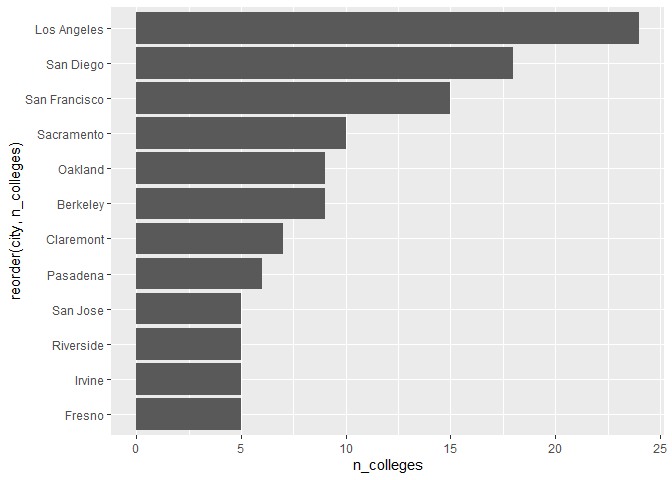
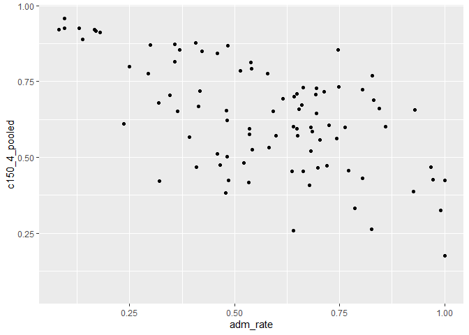
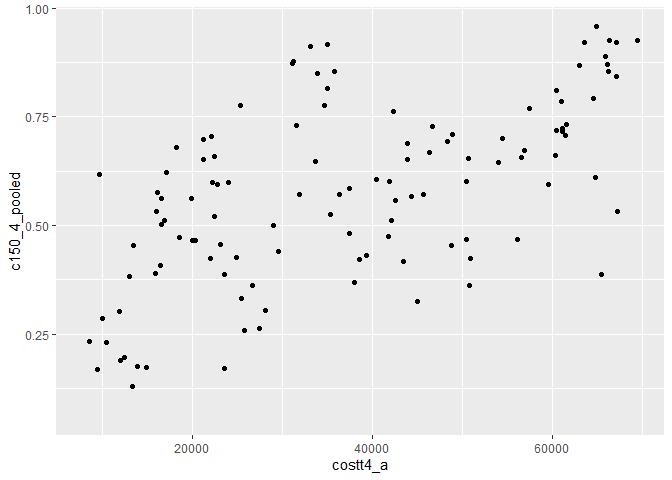
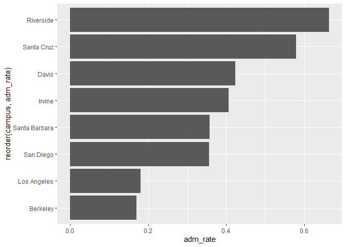
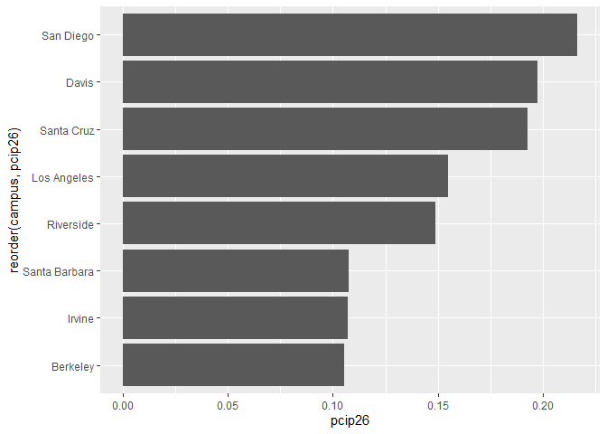

## Instructions
Answer the following questions and complete the exercises in RMarkdown. Please embed all of your code and push your final work to your repository. Your final lab report should be organized, clean, and run free from errors. Remember, you must remove the `#` for the included code chunks to run. Be sure to add your name to the author header above.  

Make sure to use the formatting conventions of RMarkdown to make your report neat and clean!  

## Load the libraries

```r
library(tidyverse)
library(janitor)
library(here)
library(naniar)
library(skimr)
```

For this homework, we will take a departure from biological data and use data about California colleges. These data are a subset of the national college scorecard (https://collegescorecard.ed.gov/data/). Load the `ca_college_data.csv` as a new object called `colleges`.

```r
colleges <- read_csv("data/ca_college_data.csv")
```

```
## 
## -- Column specification --------------------------------------------------------
## cols(
##   INSTNM = col_character(),
##   CITY = col_character(),
##   STABBR = col_character(),
##   ZIP = col_character(),
##   ADM_RATE = col_double(),
##   SAT_AVG = col_double(),
##   PCIP26 = col_double(),
##   COSTT4_A = col_double(),
##   C150_4_POOLED = col_double(),
##   PFTFTUG1_EF = col_double()
## )
```

The variables are a bit hard to decipher, here is a key:  

INSTNM: Institution name  
CITY: California city  
STABBR: Location state  
ZIP: Zip code  
ADM_RATE: Admission rate  
SAT_AVG: SAT average score  
PCIP26: Percentage of degrees awarded in Biological And Biomedical Sciences  
COSTT4_A: Annual cost of attendance  
C150_4_POOLED: 4-year completion rate  
PFTFTUG1_EF: Percentage of undergraduate students who are first-time, full-time degree/certificate-seeking undergraduate students  

1. Use your preferred function(s) to have a look at the data and get an idea of its structure. Make sure you summarize NA's and determine whether or not the data are tidy. You may also consider dealing with any naming issues.

```r
colleges
```

```
## # A tibble: 341 x 10
##    INSTNM CITY  STABBR ZIP   ADM_RATE SAT_AVG PCIP26 COSTT4_A C150_4_POOLED
##    <chr>  <chr> <chr>  <chr>    <dbl>   <dbl>  <dbl>    <dbl>         <dbl>
##  1 Gross~ El C~ CA     9202~       NA      NA 0.0016     7956        NA    
##  2 Colle~ Visa~ CA     9327~       NA      NA 0.0066     8109        NA    
##  3 Colle~ San ~ CA     9440~       NA      NA 0.0038     8278        NA    
##  4 Ventu~ Vent~ CA     9300~       NA      NA 0.0035     8407        NA    
##  5 Oxnar~ Oxna~ CA     9303~       NA      NA 0.0085     8516        NA    
##  6 Moorp~ Moor~ CA     9302~       NA      NA 0.0151     8577        NA    
##  7 Skyli~ San ~ CA     9406~       NA      NA 0          8580         0.233
##  8 Glend~ Glen~ CA     9120~       NA      NA 0.002      9181        NA    
##  9 Citru~ Glen~ CA     9174~       NA      NA 0.0021     9281        NA    
## 10 Fresn~ Fres~ CA     93741       NA      NA 0.0324     9370        NA    
## # ... with 331 more rows, and 1 more variable: PFTFTUG1_EF <dbl>
```


```r
summary(colleges)
```

```
##     INSTNM              CITY              STABBR              ZIP           
##  Length:341         Length:341         Length:341         Length:341        
##  Class :character   Class :character   Class :character   Class :character  
##  Mode  :character   Mode  :character   Mode  :character   Mode  :character  
##                                                                             
##                                                                             
##                                                                             
##                                                                             
##     ADM_RATE         SAT_AVG         PCIP26           COSTT4_A    
##  Min.   :0.0807   Min.   : 870   Min.   :0.00000   Min.   : 7956  
##  1st Qu.:0.4581   1st Qu.: 985   1st Qu.:0.00000   1st Qu.:12578  
##  Median :0.6370   Median :1078   Median :0.00000   Median :16591  
##  Mean   :0.5901   Mean   :1112   Mean   :0.01981   Mean   :26685  
##  3rd Qu.:0.7461   3rd Qu.:1237   3rd Qu.:0.02457   3rd Qu.:39289  
##  Max.   :1.0000   Max.   :1555   Max.   :0.21650   Max.   :69355  
##  NA's   :240      NA's   :276    NA's   :35        NA's   :124    
##  C150_4_POOLED     PFTFTUG1_EF    
##  Min.   :0.0625   Min.   :0.0064  
##  1st Qu.:0.4265   1st Qu.:0.3212  
##  Median :0.5845   Median :0.5016  
##  Mean   :0.5705   Mean   :0.5577  
##  3rd Qu.:0.7162   3rd Qu.:0.8117  
##  Max.   :0.9569   Max.   :1.0000  
##  NA's   :221      NA's   :53
```


```r
colleges <- clean_names(colleges)
names(colleges)
```

```
##  [1] "instnm"        "city"          "stabbr"        "zip"          
##  [5] "adm_rate"      "sat_avg"       "pcip26"        "costt4_a"     
##  [9] "c150_4_pooled" "pftftug1_ef"
```


```r
skim(colleges)
```


Table: Data summary

|                         |         |
|:------------------------|:--------|
|Name                     |colleges |
|Number of rows           |341      |
|Number of columns        |10       |
|_______________________  |         |
|Column type frequency:   |         |
|character                |4        |
|numeric                  |6        |
|________________________ |         |
|Group variables          |None     |


**Variable type: character**

|skim_variable | n_missing| complete_rate| min| max| empty| n_unique| whitespace|
|:-------------|---------:|-------------:|---:|---:|-----:|--------:|----------:|
|instnm        |         0|             1|  10|  63|     0|      341|          0|
|city          |         0|             1|   4|  19|     0|      161|          0|
|stabbr        |         0|             1|   2|   2|     0|        3|          0|
|zip           |         0|             1|   5|  10|     0|      324|          0|


**Variable type: numeric**

|skim_variable | n_missing| complete_rate|     mean|       sd|      p0|      p25|      p50|      p75|     p100|hist  |
|:-------------|---------:|-------------:|--------:|--------:|-------:|--------:|--------:|--------:|--------:|:-----|
|adm_rate      |       240|          0.30|     0.59|     0.23|    0.08|     0.46|     0.64|     0.75|     1.00|▂▃▆▇▃ |
|sat_avg       |       276|          0.19|  1112.31|   170.80|  870.00|   985.00|  1078.00|  1237.00|  1555.00|▇▇▅▂▂ |
|pcip26        |        35|          0.90|     0.02|     0.04|    0.00|     0.00|     0.00|     0.02|     0.22|▇▁▁▁▁ |
|costt4_a      |       124|          0.64| 26685.17| 18122.70| 7956.00| 12578.00| 16591.00| 39289.00| 69355.00|▇▂▂▁▂ |
|c150_4_pooled |       221|          0.35|     0.57|     0.21|    0.06|     0.43|     0.58|     0.72|     0.96|▂▃▇▇▅ |
|pftftug1_ef   |        53|          0.84|     0.56|     0.29|    0.01|     0.32|     0.50|     0.81|     1.00|▃▇▆▅▇ |

```r
colleges %>% 
  miss_var_summary()
```

```
## # A tibble: 10 x 3
##    variable      n_miss pct_miss
##    <chr>          <int>    <dbl>
##  1 sat_avg          276     80.9
##  2 adm_rate         240     70.4
##  3 c150_4_pooled    221     64.8
##  4 costt4_a         124     36.4
##  5 pftftug1_ef       53     15.5
##  6 pcip26            35     10.3
##  7 instnm             0      0  
##  8 city               0      0  
##  9 stabbr             0      0  
## 10 zip                0      0
```
It looks like the data is tidy because each variable has its own column, each observation has its own row, and each value has its own cell!

2. Which cities in California have the highest number of colleges?

```r
colleges %>%
  select(city, instnm) %>% 
  group_by(city) %>% 
  summarise(n_colleges = n()) %>% 
  arrange(desc(n_colleges))
```

```
## # A tibble: 161 x 2
##    city          n_colleges
##    <chr>              <int>
##  1 Los Angeles           24
##  2 San Diego             18
##  3 San Francisco         15
##  4 Sacramento            10
##  5 Berkeley               9
##  6 Oakland                9
##  7 Claremont              7
##  8 Pasadena               6
##  9 Fresno                 5
## 10 Irvine                 5
## # ... with 151 more rows
```

3. Based on your answer to #2, make a plot that shows the number of colleges in the top 10 cities.

```r
colleges %>%
  select(city, instnm) %>% 
  group_by(city) %>% 
  summarise(n_colleges = n()) %>%
  top_n(10, n_colleges) %>% 
  ggplot(aes(x = reorder(city, n_colleges), y = n_colleges)) +
  geom_col() +
  coord_flip()
```

<!-- -->

4. The column `COSTT4_A` is the annual cost of each institution. Which city has the highest average cost? Where is it located?

```r
colleges %>% 
  select(instnm, city, costt4_a) %>% 
  group_by(city) %>% 
  summarise(avg_cost = mean(costt4_a, na.rm = T)) %>% 
  arrange(desc(avg_cost))
```

```
## # A tibble: 161 x 2
##    city                avg_cost
##    <chr>                  <dbl>
##  1 Claremont              66498
##  2 Malibu                 66152
##  3 Valencia               64686
##  4 Orange                 64501
##  5 Redlands               61542
##  6 Moraga                 61095
##  7 Atherton               56035
##  8 Thousand Oaks          54373
##  9 Rancho Palos Verdes    50758
## 10 La Verne               50603
## # ... with 151 more rows
```
<style>
div.blue { background-color:#e6f0ff; border-radius: 5px; padding: 20px;}
</style>
<div class = "blue">

5. Based on your answer to #4, make a plot that compares the cost of the individual colleges in the most expensive city. Bonus! Add UC Davis here to see how it compares :>).

```r
colleges %>% 
  select(instnm, city, costt4_a) %>% 
  filter(city == c("Claremont", "Davis"), costt4_a != "NA") %>% 
  group_by(city) %>%
  ggplot(aes(x = instnm, y = costt4_a)) +
  geom_col()
```

```
## Warning in city == c("Claremont", "Davis"): 較長的物件長度並非較短物件長度的倍數
```

<!-- -->

</div>

6. The column `ADM_RATE` is the admissions rate by college and `C150_4_POOLED` is the four-year completion rate. Use a scatterplot to show the relationship between these two variables. What do you think this means?

```r
colleges %>% 
  ggplot(aes(x = adm_rate, y = c150_4_pooled)) +
  geom_jitter(na.rm = T)
```

<!-- -->
It looks like as admission rate increases, the four-year completion rate tends to decrease.

7. Is there a relationship between cost and four-year completion rate? (You don't need to do the stats, just produce a plot). What do you think this means?

```r
colleges %>% 
  ggplot(aes(x = costt4_a, y = c150_4_pooled)) +
  geom_jitter(na.rm = T)
```

<!-- -->
As cost of attendance increases, the four-year completion rate tends to increase. People want their money's worth -- if they are going to spend so much, might as well see it the whole way through. I would want to finish my education too, since I am spending so much money!

8. The column titled `INSTNM` is the institution name. We are only interested in the University of California colleges. Make a new data frame that is restricted to UC institutions. You can remove `Hastings College of Law` and `UC San Francisco` as we are only interested in undergraduate institutions.

```r
uc_system <- colleges %>%
  filter(str_detect(instnm, "University of California"))
uc_system
```

```
## # A tibble: 10 x 10
##    instnm city  stabbr zip   adm_rate sat_avg pcip26 costt4_a c150_4_pooled
##    <chr>  <chr> <chr>  <chr>    <dbl>   <dbl>  <dbl>    <dbl>         <dbl>
##  1 Unive~ La J~ CA     92093    0.357    1324  0.216    31043         0.872
##  2 Unive~ Irvi~ CA     92697    0.406    1206  0.107    31198         0.876
##  3 Unive~ Rive~ CA     92521    0.663    1078  0.149    31494         0.73 
##  4 Unive~ Los ~ CA     9009~    0.180    1334  0.155    33078         0.911
##  5 Unive~ Davis CA     9561~    0.423    1218  0.198    33904         0.850
##  6 Unive~ Sant~ CA     9506~    0.578    1201  0.193    34608         0.776
##  7 Unive~ Berk~ CA     94720    0.169    1422  0.105    34924         0.916
##  8 Unive~ Sant~ CA     93106    0.358    1281  0.108    34998         0.816
##  9 Unive~ San ~ CA     9410~   NA          NA NA           NA        NA    
## 10 Unive~ San ~ CA     9414~   NA          NA NA           NA        NA    
## # ... with 1 more variable: pftftug1_ef <dbl>
```

Remove `Hastings College of Law` and `UC San Francisco` and store the final data frame as a new object `univ_calif_final`.

```r
univ_calif_final <- uc_system %>% 
  filter(!str_detect(instnm, "Hastings College of Law")) %>% 
  filter(!str_detect(instnm, "San Francisco"))
univ_calif_final
```

```
## # A tibble: 8 x 10
##   instnm city  stabbr zip   adm_rate sat_avg pcip26 costt4_a c150_4_pooled
##   <chr>  <chr> <chr>  <chr>    <dbl>   <dbl>  <dbl>    <dbl>         <dbl>
## 1 Unive~ La J~ CA     92093    0.357    1324  0.216    31043         0.872
## 2 Unive~ Irvi~ CA     92697    0.406    1206  0.107    31198         0.876
## 3 Unive~ Rive~ CA     92521    0.663    1078  0.149    31494         0.73 
## 4 Unive~ Los ~ CA     9009~    0.180    1334  0.155    33078         0.911
## 5 Unive~ Davis CA     9561~    0.423    1218  0.198    33904         0.850
## 6 Unive~ Sant~ CA     9506~    0.578    1201  0.193    34608         0.776
## 7 Unive~ Berk~ CA     94720    0.169    1422  0.105    34924         0.916
## 8 Unive~ Sant~ CA     93106    0.358    1281  0.108    34998         0.816
## # ... with 1 more variable: pftftug1_ef <dbl>
```

Use `separate()` to separate institution name into two new columns "UNIV" and "CAMPUS".

```r
univ_calif_final <- univ_calif_final %>% 
  separate(instnm,
           into = c("univ", "campus"),
           sep = "-")
univ_calif_final
```

```
## # A tibble: 8 x 11
##   univ  campus city  stabbr zip   adm_rate sat_avg pcip26 costt4_a c150_4_pooled
##   <chr> <chr>  <chr> <chr>  <chr>    <dbl>   <dbl>  <dbl>    <dbl>         <dbl>
## 1 Univ~ San D~ La J~ CA     92093    0.357    1324  0.216    31043         0.872
## 2 Univ~ Irvine Irvi~ CA     92697    0.406    1206  0.107    31198         0.876
## 3 Univ~ River~ Rive~ CA     92521    0.663    1078  0.149    31494         0.73 
## 4 Univ~ Los A~ Los ~ CA     9009~    0.180    1334  0.155    33078         0.911
## 5 Univ~ Davis  Davis CA     9561~    0.423    1218  0.198    33904         0.850
## 6 Univ~ Santa~ Sant~ CA     9506~    0.578    1201  0.193    34608         0.776
## 7 Univ~ Berke~ Berk~ CA     94720    0.169    1422  0.105    34924         0.916
## 8 Univ~ Santa~ Sant~ CA     93106    0.358    1281  0.108    34998         0.816
## # ... with 1 more variable: pftftug1_ef <dbl>
```

9. The column `ADM_RATE` is the admissions rate by campus. Which UC has the lowest and highest admissions rates? Produce a numerical summary and an appropriate plot.

```r
univ_calif_final %>% 
  summarise(across(c(campus, adm_rate))) %>% 
  arrange(desc(adm_rate))
```

```
## # A tibble: 8 x 2
##   campus        adm_rate
##   <chr>            <dbl>
## 1 Riverside        0.663
## 2 Santa Cruz       0.578
## 3 Davis            0.423
## 4 Irvine           0.406
## 5 Santa Barbara    0.358
## 6 San Diego        0.357
## 7 Los Angeles      0.180
## 8 Berkeley         0.169
```
Riverside has the highest admissions rate, while Berkeley has the lowest.


```r
univ_calif_final %>% 
  ggplot(aes(x = reorder(campus, adm_rate), y = adm_rate)) +
  geom_col() +
  coord_flip()
```

<!-- -->

10. If you wanted to get a degree in biological or biomedical sciences, which campus confers the majority of these degrees? Produce a numerical summary and an appropriate plot.

```r
univ_calif_final %>% 
  summarise(across(c(campus, pcip26))) %>% 
  arrange(desc(pcip26))
```

```
## # A tibble: 8 x 2
##   campus        pcip26
##   <chr>          <dbl>
## 1 San Diego      0.216
## 2 Davis          0.198
## 3 Santa Cruz     0.193
## 4 Los Angeles    0.155
## 5 Riverside      0.149
## 6 Santa Barbara  0.108
## 7 Irvine         0.107
## 8 Berkeley       0.105
```


```r
univ_calif_final %>% 
  ggplot(aes(x = reorder(campus, pcip26), y = pcip26)) +
  geom_col() +
  coord_flip()
```

<!-- -->

## Knit Your Output and Post to [GitHub](https://github.com/FRS417-DataScienceBiologists)
